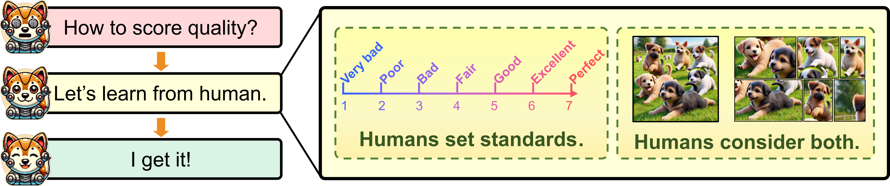
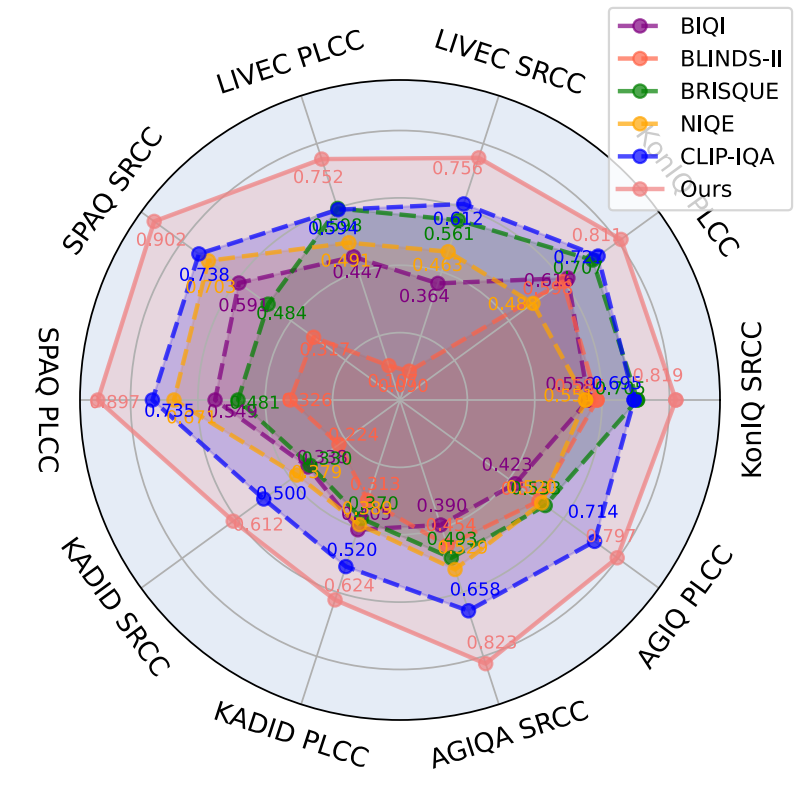
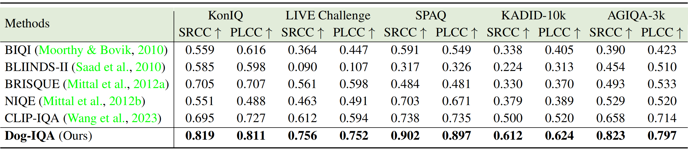
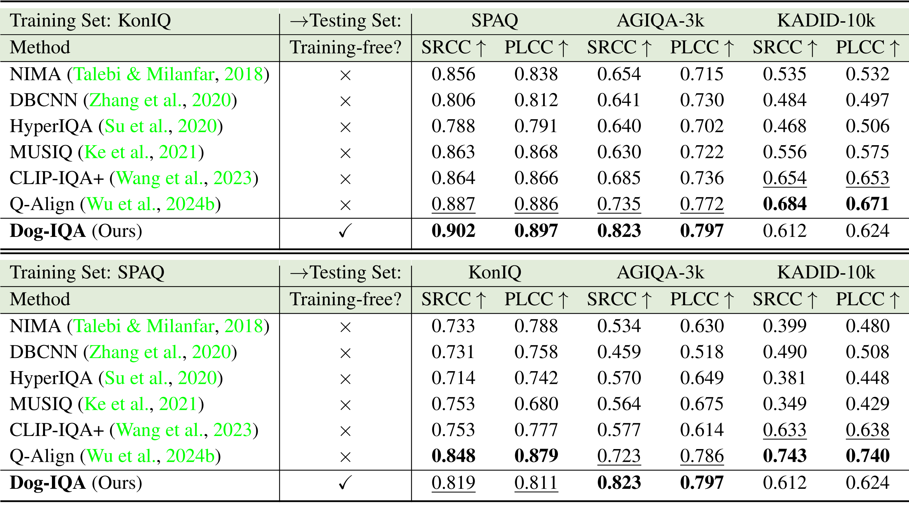

  

# Dog-IQA: Standard-guided Zero-shot MLLM for Mix-grained Image Quality Assessment
PyTorch code for our paper "Dog-IQA: Standard-guided Zero-shot MLLM for Mix-grained Image Quality Assessment"

[Kai Liu](https://kai-liu001.github.io/), [Ziqing Zhang](), [Wenbo Li](https://fenglinglwb.github.io/), [Renjing Pei](https://orcid.org/0000-0001-7513-6576), [Fenglong Song](https://scholar.google.com/citations?hl=zh-CN&pli=1&user=WYDVk5oAAAAJ), [Xiaohong Liu](https://jhc.sjtu.edu.cn/~xiaohongliu/), [Linghe Kong](https://www.cs.sjtu.edu.cn/~linghe.kong/), and [Yulun Zhang](http://yulunzhang.com/)

"Dog-IQA: Standard-guided Zero-shot MLLM for Mix-grained Image Quality Assessment", arXiv, 2024

[[arXiv]()] [[supplementary material](https://github.com/Kai-Liu001/Dog-IQA/releases/tag/v1)] [visual results] 

#### 🔥🔥🔥 News

- **2024-10-03:** Add pipeline figure and results. 
- **2024-10-01:** This repo is released! 🎉🎉🎉

---

> **Abstract:** Image quality assessment (IQA) serves as the golden standard for all models' performance in nearly all computer vision fields. However, it still suffers from poor out-of-distribution generalization ability and expensive training costs. To address these problems, we propose Dog-IQA, a standard-guided zero-shot mix-grained IQA method, which is training-free and utilizes the exceptional prior knowledge of multimodal large language models (MLLMs). To obtain accurate IQA scores, namely scores consistent with humans, we design an MLLM-based inference pipeline that imitates human experts. In detail, Dog-IQA applies two techniques. First, Dog-IQA objectively scores with specific standards that utilize MLLM's behavior pattern and minimize the influence of subjective factors. Second, Dog-IQA comprehensively takes local semantic objects and the whole image as input and aggregates their scores, leveraging local and global information. Our proposed Dog-IQA achieves state-of-the-art (SOTA) performance compared with training-free methods, and competitive performance compared with training-based methods in cross-dataset scenarios. Our code and models will be available at https://github.com/Kai-Liu001/Dog-IQA.

---

  

  

---

Radar plot in Figure 1 of the main paper

  

---

## ⚒ TODO

* [ ] Release code

## 🔗 Contents

1. Datasets
2. Evaluation
3. [Results](#-results)
4. [Citation](#-citation)
4. [Acknowledgements](#-acknowledgements)

## 🔎 Results

We achieve SOTA performance on various dataset compared with training-free approaches.

Comparisons with Training-free methods. (click to expand)

- Quantitative comparisons in Table 2 of the main paper

  

Comparisons with Training-based methods. (click to expand)

- Quantitative comparisons in Table 3 of the main paper

  

Visual Results. (click to expand)

- Visual result in Figure 5 of the main paper.

  

- Visual result in Figure 2 of the supplementary material.

  

## 📎 Citation

If you find the code helpful in your resarch or work, please cite the following paper(s).

TBD.

## 💕💖💕 Acknowledgements

Thanks to [mPLUG-Owl3](https://github.com/X-PLUG/mPLUG-Owl) and [SAM2](https://github.com/facebookresearch/sam2) for their outstanding models.